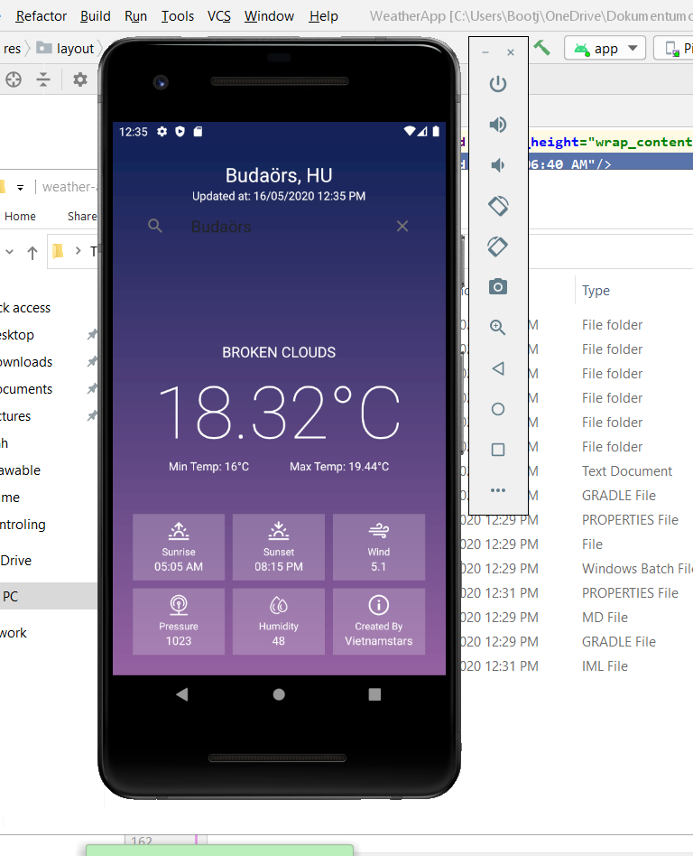

# Idő előrejelző applikáció androidra
## Leírás:
Egy egyszerű, nyitott forrású applikáció Androidra **Android Studio** felhasználásával. Az információkat az OpenWeatherMap-ról gyűjti a [publikus API-n keresztül]().

## Készült: 
- Java
- Nativescript (Javascript framework)
- OpenWeatherMap API
- GooglePlace API

## Tulajdonságok:
- Egyszerű megjelenés
- Sok funkció
- Minden várossal működik a világon

## A képernyőkép funkció 

